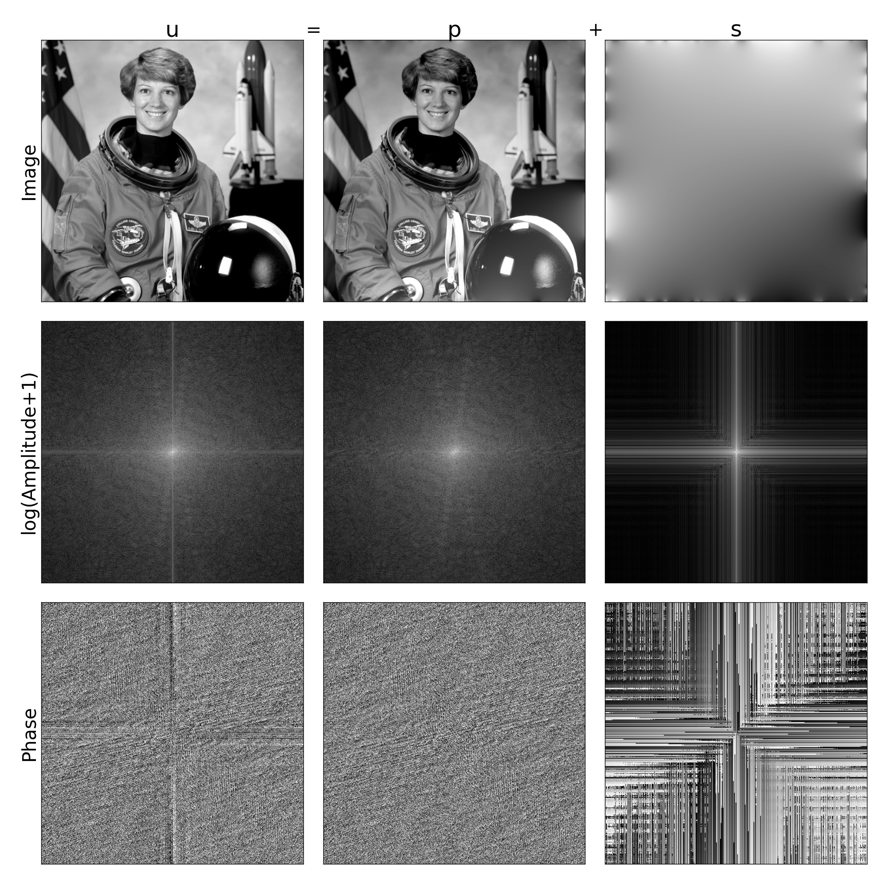

# Periodic plus smooth image decomposition

This repository implements "Periodic plus smooth image decomposition," as [described by Lionel Moisan.](http://www.math-info.univ-paris5.fr/~moisan/papers/2009-11r.pdf)

*Periodic Plus Smooth Image Decomposition*  
Moisan, L. J Math Imaging Vis (2011) 39: 161.  
doi.org/10.1007/s10851-010-0227-1  

## What is periodic plus smooth decomposition?

Periodic plus smooth decomposition (PS decomposition) separates an image into its additive "periodic" and "smooth" components. 

This decomposition is defined as splitting a gray image `u` into periodic `p` and smooth `s` components. 

We reference the paper for proper formal treatment of the topic, but in colloquial terms the image `p` contains only information in `u` that respects periodic assumptions and `s` is "maximally smooth," such that each pixel in `s` is equal to the mean of its neighbors.

## What does that mean and why is it useful?

The discrete Fourier transform (DFT) is a common and useful analytical technique for images. Many operations can be computed more cheaply or are more intuitive in the Fourier domain. Applications of DFT range from image interpolation to image registration. 

DFT assumes that the signal data it operates on is periodic. However, this is obviously not true for the vast majority of images, which will experience artifacts at the boundaries due to their non-periodic nature. 

One of the most common of these artifacts is a large "cross" in the Fourier domain, demonstrated in the first row below.

By decomposing an image into a component that respects this periodicity assumption, this artifact can be removed, as shown in the second row.



## What's in this repo?

In `psd.py` you'll find functions to compute the PS decomposition. 

```bash
python psd.py
```
will reproduce the figure above.

Happy decomposing!


